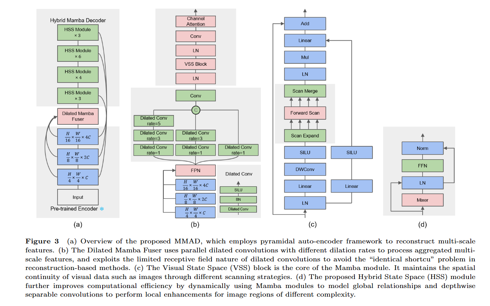
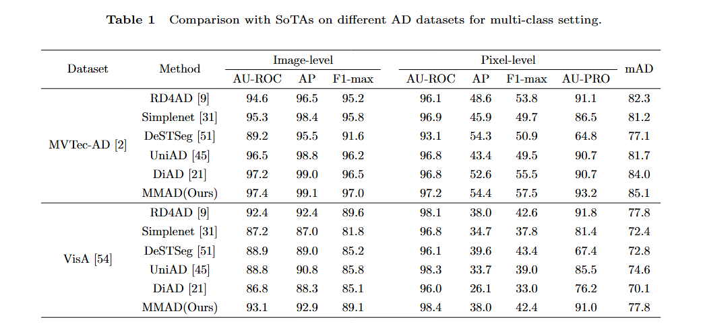
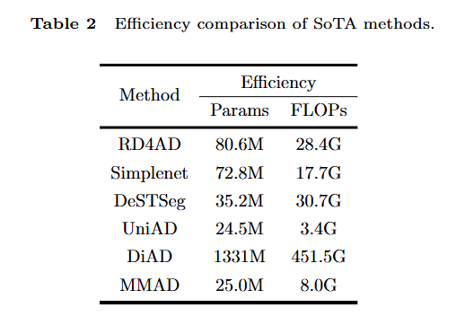
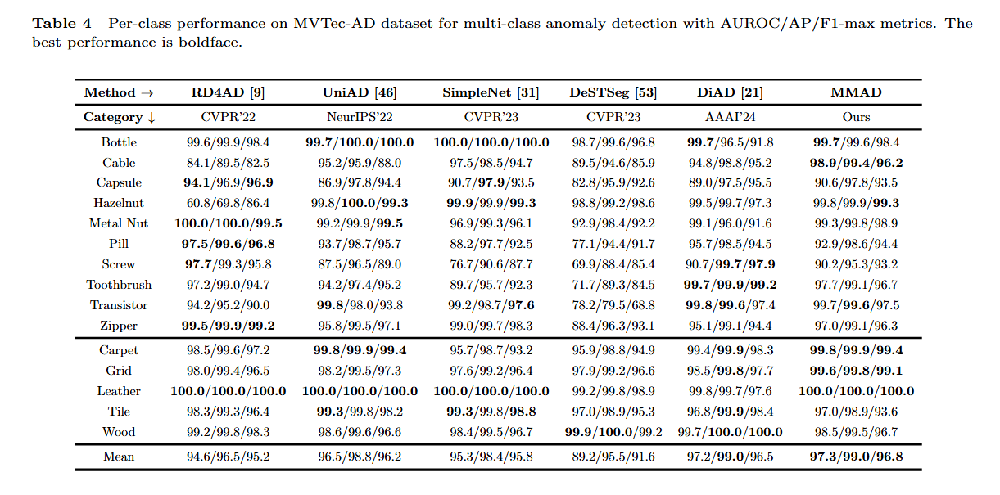
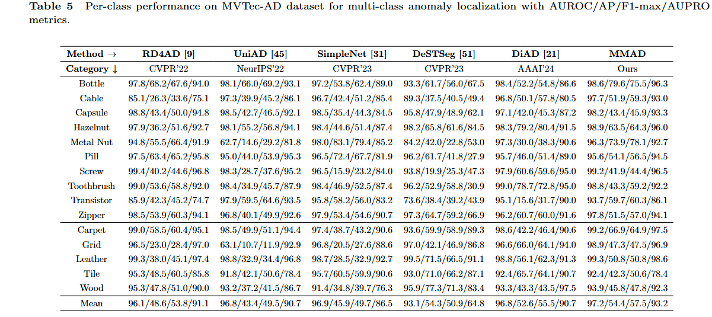

# A Unified Model for Multi-class Unsupervised Anomaly Detection with State Space Model

  

  

## Table of Contents
- [Abstract](#abstract)
- [Results](#results)
- [Authors](#authors)

## Introduction
Unsupervised anomaly detection aims to identify data instances that significantly deviate from the norm without the need for labeled training data. Traditional approaches typically utilize a one-class-one-model strategy for each category, which becomes memory-intensive and impractical as the number of categories increases. To address this limitation, multi-class anomaly detection has emerged as a more feasible alternative, focusing on the development of a unified model capable of detecting anomalies across various categories. Most existing methods rely on Convolutional Neural Networks (CNNs) and transformer architectures, both demonstrating robust performance. However, CNNs often struggle to capture long-range dependencies, while transformers are hindered by quadratic computational complexity. Recently, state space models have garnered significant attention due to their superior long-range modeling capabilities coupled with linear computational complexity. In this paper, we explore the application of state space models in anomaly detection and propose a unified model for multi-class anomaly detection. Our model comprises a pre-trained encoder, a multi-scale feature fusion module, and a decoder. The proposed Dilated Mamba Fuser (DMF) uses dilated convolutions with different dilation rates to prevent the long-standing ``identical shortcut'' problem in reconstruction-based methods and combines the plain Mamba block to increase the receptive field. The proposed Hybrid Mamba Decoder (HMD) features multiple Hybrid State Space (HSS) modules stacked at different scales. These HSS modules integrate state space models and convolutional neural networks to efficiently process regions of varying complexity. Additionally, the Grouped State Space (GSS) blocks within the HSS modules employ a group scanning strategy to enhance the quality-complexity trade-off. Comprehensive experiments on diverse benchmark datasets demonstrate the superior performance of our method. For implementation details and access to the code, please contact the authors via email.

## Results

  

  

  

  

  

  

## Authors
This project was developed by:

- **Xuesen Ma**
- **Yudong Xu**
- **Dacheng Li**
- **Wei Jia**
- **Yang Wang**
- **Meng Wang**

