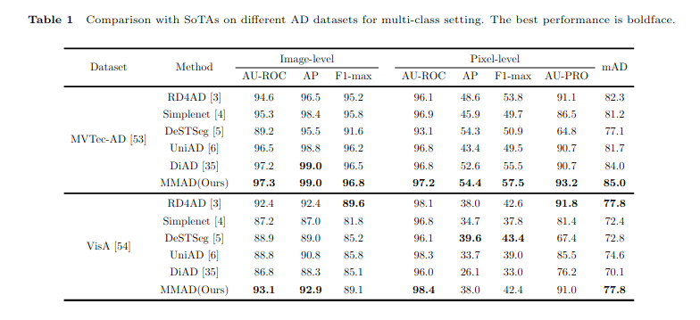

# A Unified Model for Multi-class Unsupervised Anomaly Detection with State Space Model

  

## Table of Contents
- [Abstract](#abstract)
- [Results](#results)
- [Authors](#authors)

## Abstract
Unsupervised anomaly detection aims to identify data instances that significantly deviate from the norm without the need for labeled training data. Traditional approaches typically utilize a one-class-one-model strategy for each category, which becomes memory-intensive and impractical as the number of categories increases. To address this limitation, multi-class anomaly detection has emerged as a more feasible alternative, focusing on the development of a unified model capable of detecting anomalies across various categories. This repository contains source code for MMAD implemented with PyTorch. MMAD is a unified model for multi-class anomaly detection tasks based on state-space models.

## Results

  

  

  

  

  

  

## Authors
This project was developed by:

- **Xuesen Ma**
- **Yudong Xu**
- **Dacheng Li**
- **Wei Jia**
- **Yang Wang**
- **Meng Wang**

