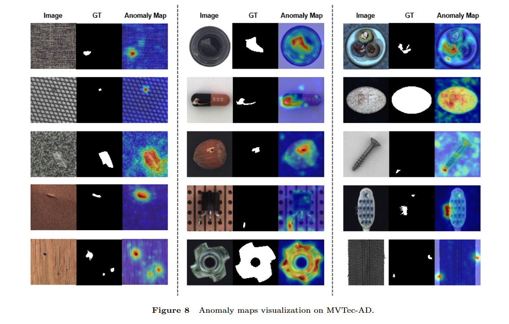

# A Unified State Space Model for Multi-class Unsupervised Anomaly Detection

<p align="center">
  
</p>

## Table of Contents
- [Abstract](#abstract)
- [Environments](#environments)
- [Dataset](#dataset)
- [Results](#results)
- [Authors](#authors)
- [Acknowledgements](#acknowledgements)

## Abstract
Unsupervised anomaly detection aims to identify data instances that significantly deviate from the norm without the need for labeled training data. Traditional approaches typically utilize a one-class-one-model strategy for each category, which becomes memory-intensive and impractical as the number of categories increases. To address this limitation, multi-class anomaly detection has emerged as a more feasible alternative, focusing on the development of a unified model capable of detecting anomalies across various categories. This repository contains source code for MMAD implemented with PyTorch. MMAD is a unified model for multi-class anomaly detection tasks based on state-space models.

## Environments
Our MMAD is based on [ADer](https://github.com/zhangzjn/ADer). Please clone this repo to ADer.
Create a new conda environment and install required packages.
```shell
  pip3 install timm==0.8.15dev0 mmselfsup pandas transformers openpyxl imgaug numba numpy tensorboard fvcore accimage Ninja
  pip3 install mmdet==2.25.3
  pip3 install --upgrade protobuf==3.20.1 scikit-image faiss-gpu
  pip3 install adeval
  pip3 install torch==2.1.2 torchvision==0.16.2 torchaudio==2.1.2 --index-url https://download.pytorch.org/whl/cu118
  pip3 install fastprogress geomloss FrEIA mamba_ssm adeval fvcore==0.1.5.post20221221
  (or) conda install pytorch==2.1.2 torchvision==0.16.2 torchaudio==2.1.2 pytorch-cuda=11.8 -c pytorch -c nvidia
  ```
**Experiments are conducted on a NVIDIA RTX 3080.**

## Dataset

#### MVTec-AD and VisA 
The dataset format is as follows:
```
path1
├── mvtec
    ├── bottle
        ├── train
            ├── good
                ├── 000.png
        ├── test
            ├── good
                ├── 000.png
            ├── anomaly1
                ├── 000.png
        ├── ground_truth
            ├── anomaly1
                ├── 000.png
```

```
path2
├── visa
    ├── candle
        ├── Data
            ├── Images
                ├── Anomaly
                    ├── 000.JPG
                ├── Normal
                    ├── 0000.JPG
            ├── Masks
                ├── Anomaly
                    ├── 000.png
    ├── split_csv
        ├── 1cls.csv
        ├── 1cls.xlsx
```

## Results
<p align="center">
  
</p>

<p align="center">
  
</p>


## Authors
This project was developed by:

- **Xuesen Ma**
- **Yudong Xu**
- **Dacheng Li**
- **Wei Jia**
- **Yang Wang**
- **Meng Wang**

## Acknowledgements
We thank the great works [ADer](https://github.com/zhangzjn/ADer), [VMamba](https://github.com/MzeroMiko/VMamba) for providing assistance for our research.


